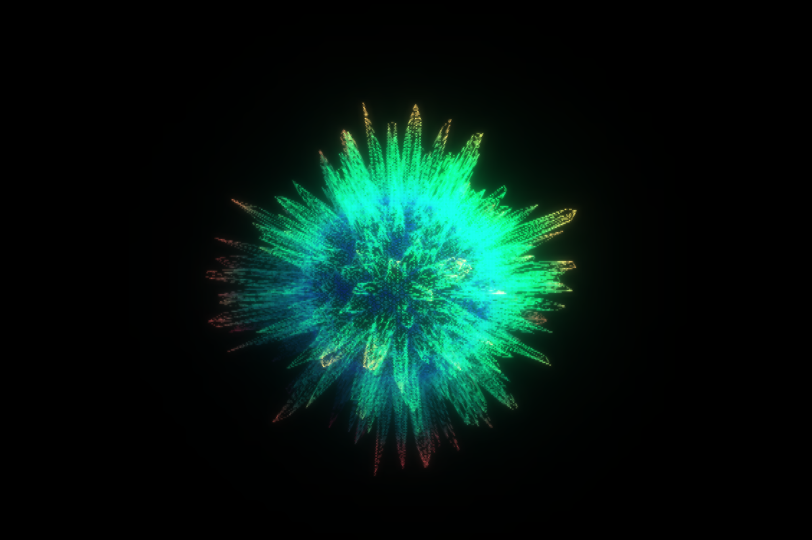

# Hexa Vision

A real-time WebGL visual experiment built with Three.js, combining procedural surface displacement driven by animated Voronoi noise with a post-processing pass that fragments the entire rendered scene through a hexagonal grid — simulating the compound eye of an insect looking out at a pulsing, organic form.

The result sits somewhere between generative sculpture and perceptual illusion. The geometry breathes. The viewport fractures it into hundreds of tessellated cells. Everything is tunable at runtime.

---

## What It Does

An icosahedron subdivided to high resolution rotates at the center of the scene. Its surface is continuously displaced and coloured by a custom GLSL shader that computes animated Voronoi patterns directly on the GPU. Over the top of everything sits the HexaVision pass, a fullscreen ShaderPass that remaps UV coordinates into a hexagonal grid and masks out the space between cells — turning the rendered output into something that reads like vision through a compound eye.

The pipeline goes: geometry shader rendering, then an UnrealBloomPass for luminance glow, then the HexaVision pass as the final composited output. The bloom happens beneath the hex grid, so light bleeds within each cell rather than across boundaries.

An on-canvas double-click randomizes all shader parameters simultaneously, making the piece behave differently every few seconds without reloading.

### Live Example

<div style="text-align: center; margin: 2rem 0;">
  
  <p style="margin-top: 1rem; font-size: 0.9em; color: #888;">The dynamic interplay of displacement mapping and the hexagonal compound-eye filter in real-time.</p>
</div>

---

## The Math Worth Paying Attention To

**Voronoi noise with temporal blending**

Standard Voronoi gives you a static partition of space. Here, two independent Voronoi evaluations are computed per fragment — one at time `t` and one at `t + 1.0` — and smoothly interpolated using `fract(t)` as the blend factor. This creates a continuously morphing cellular pattern without any discontinuity at integer time boundaries. Each cell's seed point is additionally perturbed by a hash-based noise function before the distance computation, which means the cell boundaries themselves drift organically rather than oscillating predictably.

The distance metric used is `secondMinDist - minDist`, which gives the width of the boundary region between the two nearest seeds rather than the distance to a single nearest point. This is sometimes called F2 minus F1 Voronoi, and it produces the ridge-like outlines you see on the surface rather than filled polygonal regions.

**Triplanar projection**

Mapping a 2D noise function onto a sphere always produces distortion or seaming at the poles if you use standard UV coordinates. The vertex shader sidesteps this entirely by evaluating the Voronoi pattern three times — once per axis plane (XY, XZ, YZ) — and blending the results using the surface normal as a weight. Faces pointing along the X axis get mostly the YZ sample, and so on. The blending weights are normalized so they sum to 1.0 across any normal direction, which means the transition between projection axes is seamless regardless of where on the sphere you are.

**Hexagonal grid coordinates**

The HexaVision fragment shader converts screen-space UV coordinates into a hex grid by accounting for the offset rows that define a hexagonal tiling. Even rows sit flush, odd rows are shifted by half a cell width. After snapping each UV to its nearest hex center, a geometric mask is applied to cut away the inter-cell gaps. The mask computes the distance to the hex boundary analytically using the symmetry of a regular hexagon, avoiding any texture lookup or iterative sampling.

---

## Parameters and What They Change

Everything is exposed in the dat.GUI panel, which opens from the top-right corner. The interesting levers are:

**Ommatidia Size** changes how large each hexagonal cell in the HexaVision pass appears. Small values push it toward a dense mosaic; large values let more of the underlying geometry read through each cell. At very high values the hexagonal structure mostly disappears, and at very low values the output becomes nearly abstract.

**Displacement Strength** controls how far the surface vertices are pushed outward along their normals by the Voronoi pattern. Negative values pull inward, which collapses parts of the geometry and creates a very different silhouette. Combined with a high Pattern Scale, negative displacement can make the surface look cracked or corroded rather than scaled.

**Noise Strength** perturbs the Voronoi seed points before distance computation. At 0.0 the cells are clean and regular. At 1.0 they become irregular and biological-looking. Anything in between sits on a spectrum from geometric to organic.

**Outline Width** shifts the threshold at which the F2-F1 pattern transitions from outline to fill. Low values produce thin wireframe-like ridges between cells. High values invert the visual weight, making the ridges thick and the cell interiors small.

If you wanted to replace the Voronoi pattern entirely with a different noise function — Worley, Perlin, or a hand-authored texture — the `triplanar()` call in the vertex shader is where that swap would happen. Feeding in a hexagonal noise function here, for instance, would create resonance between the surface pattern and the screen-space hex grid, which would read very differently from the current offset between the two.

---

## Running Locally

This project has no build step and no npm dependencies. It imports Three.js and anime.js directly from Skypack CDN, and loads dat.GUI from a CDN script tag in the HTML. Open `index.html` in a browser that supports ES modules and WebGL 2 and it runs immediately. A local server is required (browsers block ES module imports from `file://` paths).

```bash
# Python
python -m http.server 8080

# Node
npx serve .
```

Clone the repository with `git clone https://github.com/QC20/hexa-vision.git` and serve from the root.